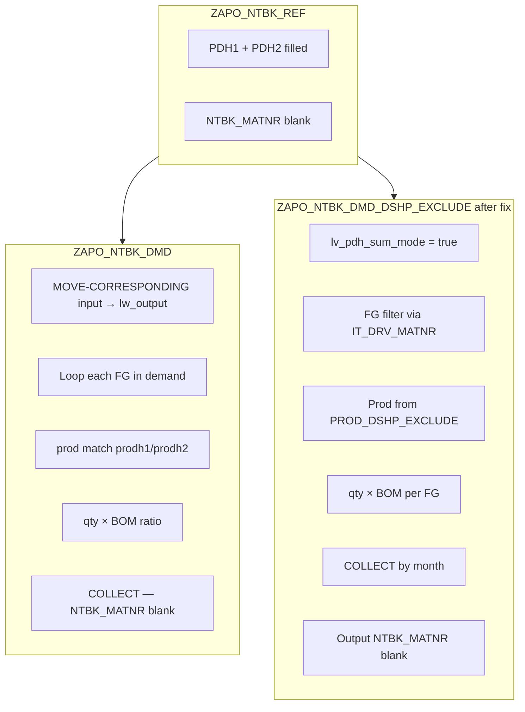

# ZAPO_NTBK_DMD_DSHP_EXCLUDE — PH1/PH2 Summation (align with ZAPO_NTBK_DMD)

**System:** AD1 (`http://DEVSCMAD1.ril.com:8000`)  
**Include:** `SAPLZAPO_NTBK` / function group `ZAPO_NTBK`  
**FM to change:** `ZAPO_NTBK_DMD_DSHP_EXCLUDE` **only**  
**Reference FM:** `ZAPO_NTBK_DMD`  
**Date:** 08-Jul-2026  
**AD1 source verified:** `get_function_source_mcp` — 08-Jul-2026  

---

## 1. Requirement

When `ZAPO_NTBK_REF` has **PDH1** and **PDH2** maintained and **NTBK_MATNR** (FG) is **blank**:

| Output field | Expected (same as `ZAPO_NTBK_DMD`) |
|--------------|-------------------------------------|
| `NTBK_QTY` | **Sum** of RM netback qty for all FG(s) under PH1 + PH2 |
| `NTBK_MATNR` | **Blank** |
| `PDH1` / `PDH2` | From input only |
| `ZVTWEG` | Combined from input (e.g. `10,65`) |

**Out of scope — no change:**

- `ZAPO_NTBK_PROD_DSHP_EXCLUDE` (dummy-customer / ship-exclude logic)
- RM BOM formula: `FG_prod_qty × (req_prnt_qty / pds_out_qty)` per FG before sum

---

## 2. How `ZAPO_NTBK_DMD` achieves PH summation (AD1 live code)

In `ZAPO_NTBK_DMD`, each demand/FG iteration does:

```abap
CLEAR: lw_output.
MOVE-CORRESPONDING <lfs_input> TO lw_output.   " NTBK_MATNR blank when input FG blank
CLEAR: lw_output-ntbk_index.
...
READ TABLE lt_prod_out ASSIGNING <lfs_ntbk_prod> WITH KEY
  ...
  prodh1 = <lfs_input>-pdh1
  prodh2 = <lfs_input>-pdh2.
...
lw_output-ntbk_qty = lw_output-ntbk_qty * <lfs_dmdvsup>-req_qty_pmt_matnr_out.
COLLECT lw_output INTO lt_output.               " sums qty — NTBK_MATNR stays blank
```

**Key:** `lw_output` is always built from `<lfs_input>` (blank FG). `COLLECT` adds RM qty from B120MA, C080MA, etc. into **one row** per month / PH / DC scope because **`ntbk_matnr` is not part of the distinguishing key** (it remains initial).

Prod match uses **`prodh1` / `prodh2`** = input `pdh1` / `pdh2`.

---

## 3. Current AD1 code in `ZAPO_NTBK_DMD_DSHP_EXCLUDE`

AD1 already contains PH hierarchy logic (**CD:8089788 / TR:AD1K917585**, 08-Jul-2026):

- `lv_pdh_sum_mode` when `ntbk_matnr IS INITIAL` and PH1/PH2 filled
- FG list from `IT_DRV_MATNR` (`ZLOG_NTBK_GET_MATNR`) filtered by `prodh1`/`prodh2`
- Prod rows from `ZAPO_NTBK_PROD_DSHP_EXCLUDE` (`lt_prod_dshpex_op`) filtered by valid FG + plant + DC
- BOM ratio from `lt_dmd_hash` / `lt_log_bom_2`
- Month-wise sum via `COLLECT lw_pdh_month_qty INTO lt_pdh_month_agg`

`ZAPO_NTBK_COMB_PREPARE` is correctly skipped (`ELSE` at line ~992) when `lv_pdh_sum_mode = abap_true`.

### Gap vs `ZAPO_NTBK_DMD`

Output build **sets FG list on `NTBK_MATNR`** instead of leaving it blank:

```abap
" Current AD1 (CD 8089788) — ~line 674-690
MOVE-CORRESPONDING <lfs_input> TO lw_output_agg.
...
lw_output_agg-ntbk_qty    = lw_pdh_month_qty-ntbk_qty.
lw_output_agg-ntbk_matnr  = lv_fg_list.    " ← B120MA,C080MA — NOT aligned with ZAPO_NTBK_DMD
APPEND lw_output_agg TO lt_output.
```

This produces separate-looking FG data or comma-separated FG codes. **`ZAPO_NTBK_DMD` keeps `NTBK_MATNR` blank.**

### Secondary issue in non-PH paths (COMB / RM-only)

When PH is **not** in sum mode, COMB loops still assign:

```abap
lw_output-ntbk_matnr = lw_prod_dshpex_op-ntbk_matnr.   " per-FG row
COLLECT lw_output_agg INTO lt_output_agg.
```

That is correct **only when input FG is maintained**. No change needed for PH-sum path beyond blank `NTBK_MATNR`.

---

## 4. Code correction (minimal — DMD FM only)

### 4.1 Fix output row — keep `NTBK_MATNR` blank (mandatory)

**Location:** `ZAPO_NTBK_DMD_DSHP_EXCLUDE`, block `IF lv_pdh_sum_mode = abap_true`, loop `LOOP AT lt_pdh_month_agg`.

**Replace:**

```abap
          lw_output_agg-ntbk_matnr  = lv_fg_list.
```

**With:**

```abap
          CLEAR lw_output_agg-ntbk_matnr.    " align with ZAPO_NTBK_DMD — PH level only
```

`MOVE-CORRESPONDING <lfs_input> TO lw_output_agg` already leaves `ntbk_matnr` initial when input FG is blank. The explicit `CLEAR` prevents any accidental carry-over.

Ensure PDH stays from input (already via `MOVE-CORRESPONDING`):

```abap
          lw_output_agg-pdh1 = <lfs_input>-pdh1.
          lw_output_agg-pdh2 = <lfs_input>-pdh2.
```

### 4.2 Remove unused FG list build (optional cleanup)

The following block only builds `lv_fg_list` for display on `NTBK_MATNR`. After §4.1 it is **dead code** and can be removed to simplify:

| Remove | Purpose |
|--------|---------|
| `lt_fg_mth`, `lt_pdh_fg_list` types/tables | FG comma-list tracking |
| `lv_fg_list`, `lv_curr_mth` | FG string builder |
| Loop `LOOP AT lt_fg_mth` + `READ TABLE lt_pdh_fg_list` | No longer needed |

**Keep:** `lt_fg_valid` + filter on `it_drv_matnr` — still required to know which FGs belong to PH1/PH2.

### 4.3 No change to prod / dummy-customer logic

```abap
" ZAPO_NTBK_PROD_DSHP_EXCLUDE — DO NOT MODIFY
" - ZAPOPARAM SHP_EXCLUDE
" - lt_demand_by_month / dummy_qty CASE
" - lv_demand_plus_promo_qty / lv_demand_plus_dummy_qty
```

PH-sum block only **reads** `lt_prod_dshpex_op-ntbk_qty` (already dummy-ship-adjusted).

### 4.4 Full corrected output loop (paste-ready)

```abap
        LOOP AT lt_pdh_month_agg INTO lw_pdh_month_qty.

          CLEAR lw_output_agg.
          MOVE-CORRESPONDING <lfs_input> TO lw_output_agg.
          CLEAR lw_output_agg-ntbk_index.
          lw_output_agg-sessionname = is_session-sessionname.
          lw_output_agg-ntbk_mth    = lw_pdh_month_qty-ntbk_mth.
          lw_output_agg-ntbk_qty    = lw_pdh_month_qty-ntbk_qty.
          CLEAR lw_output_agg-ntbk_matnr.           " >>> CD:8089788 fix — blank FG like ZAPO_NTBK_DMD
          lw_output_agg-pdh1        = <lfs_input>-pdh1.
          lw_output_agg-pdh2        = <lfs_input>-pdh2.
          lw_output_agg-zvtweg      = <lfs_input>-zvtweg.
          lw_output_agg-ntbk_locfr  = <lfs_input>-ntbk_locfr.
          APPEND lw_output_agg TO lt_output.

        ENDLOOP.
```

---

## 5. Logic flow comparison



| Step | `ZAPO_NTBK_DMD` | `ZAPO_NTBK_DMD_DSHP_EXCLUDE` (after fix) |
|------|-----------------|---------------------------------------------|
| Prod FM | `ZAPO_NTBK_PROD` | `ZAPO_NTBK_PROD_DSHP_EXCLUDE` (unchanged) |
| FG filter | `prodh1`/`prodh2` on `lt_prod_out` | `it_drv_matnr` + `lt_fg_valid` |
| RM qty | `prodn × sup_cust ratio × BOM` | `prod_dshpex_op-ntbk_qty × BOM` |
| Sum key | `COLLECT lw_output` (blank FG) | `COLLECT lt_pdh_month_agg` by month |
| Output FG | **Blank** | **Blank** (after §4.1) |

---

## 6. Expected result

### Index 1837 — ETHYLENE / 3925 / PPCOPOL. / ICP. / DC `10,65`

| NTBK_MTH | ZVTWEG | NTBK_RMMATNR | NTBK_MATNR | PDH1 | PDH2 | NTBK_QTY |
|----------|--------|--------------|------------|------|------|----------|
| 202608 | 10,65 | ETHYLENE | *(blank)* | PPCOPOL. | ICP. | **202.746** |

One row per month — not separate B120MA / C080MA lines.

---

## 7. Test plan (AD1)

| # | Test | Pass criteria |
|---|------|---------------|
| T1 | Index 1837, month 202608 | 1 row; `NTBK_MATNR` **blank**; `NTBK_QTY = 202.746` |
| T2 | Index 1838, DC `20,25` | 1 row/month; summed qty; `NTBK_MATNR` blank |
| T3 | Input with **FG = B120MA** | Per-FG row; `NTBK_MATNR = B120MA` (COMB path) |
| T4 | `ZAPO_NTBK_DMD` index 1691 | Regression — unchanged |
| T5 | Dummy-ship exclusion | `ZAPO_NTBK_PROD_DSHP_EXCLUDE` not modified |

---

## 8. Transport checklist

| Change | FM | TR note |
|--------|-----|---------|
| `CLEAR lw_output_agg-ntbk_matnr` in PH-sum output loop | `ZAPO_NTBK_DMD_DSHP_EXCLUDE` | CD:8089788 follow-up |
| Remove `lv_fg_list` / `lt_fg_mth` dead code (optional) | same | Cleanup |
| **No change** | `ZAPO_NTBK_PROD_DSHP_EXCLUDE` | Dummy customer logic |

---

## 9. Related documents

| File | Topic |
|------|-------|
| `ZAPO_NTBK_DMD_DSHP_EXCLUDE_PDH1_PDH2_Correction.md` | `prodh1`/`prodh2` filter |
| `ZAPO_NTBK_DMD_DSHP_EXCLUDE_ZVTWEG_Sum_Correction.md` | Combined DC |
| `ZAPO_NTBK_DMD_DSHP_EXCLUDE_AD1_Analysis_Corrections.md` | BOM, multi-plant |

---

**Path:** `Netback Calculation\ZAPO_NTBK_DMD_DSHP_EXCLUDE_PH1_PH2_FG_Sum_Correction.md`  
**Author:** mahesh pathak — CD 8089788 PH output alignment with `ZAPO_NTBK_DMD`
